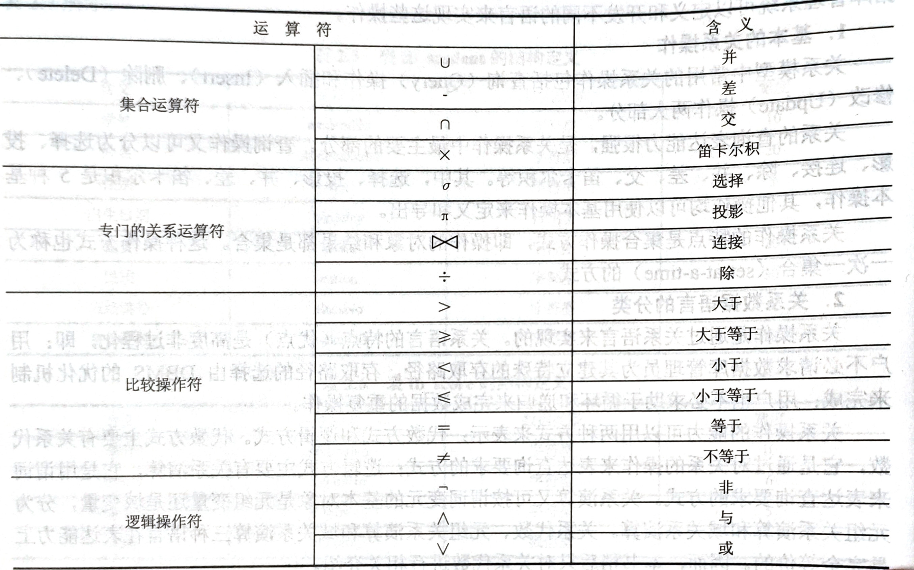

# 关系代数

关系代数是关系操作语言的一种传统表示方式，它是以集合代数为基础发展起来的



参与并、差、交计算的两个关系必须具有相同的属性个数

## 选择

```sql
SELECT 关系名 WHERE 条件
```

## 投影
```sql
PROJECTION 关系名 (属性名1,属性名2,...,属性名n)
```

经过投影运算所形成的新关系中不含重复元组，其属性按语句中给出的顺序排列

## 连接
```sql
JOIN 关系名1 AND 关系名2 WHERE 条件
```
